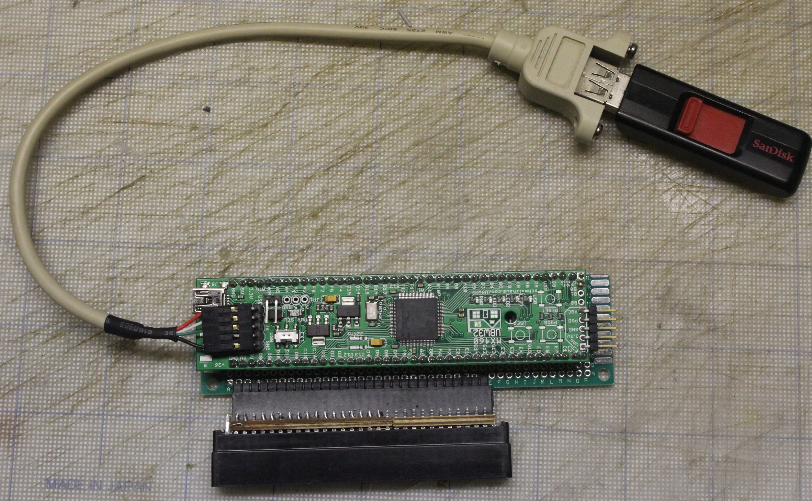

# RD-5x controller/disk emulator for DEC Professional 3xx computer

This project contains software for the PIC32 microcontroller that implements the hard disk controller and the hard disk of the RD5X model on the internal bus of an old computer [Professional 3xx](https://en.wikipedia.org/wiki/DEC_Professional_(computer)) from Digital Equipment Corporation.

The software was tested on a prototype device connecting the microcontroller board [UBW32](http://www.schmalzhaus.com/UBW32/) to the CTI bus of the PPO-3XX computer. The description of the prototype is also contained in the project.

The project is not finished yet: at present, the prototype is successfully running under the RT-11 OS, but the P/OS OS has not yet been successfully started from device.

## Iron



The signals from the CTI bus are connected directly to the pins of the PIC32MX795F512L microcontroller. Physically COTS microcontroller board [UBW32] (http://www.schmalzhaus.com/UBW32/) is mounted with two parallel connectors on a breadboard.

The breadboard is soldered to a socket commonly used on IBM PC motherboards for the ISA bus. This socket has the same pin spacing as the original connector on CTI bus devices. The spring-loaded contacts in the socket allow the connector to be plugged into the CTI bus with acceptable mechanical and electrical stability.

The connections between the pins of the connectors on the breadboard are made by soldering with speaker wire.


The list of electrical circuits is in the file [pinout.txt](./pinout.txt) in the form of a table, where the **CTI** column contains the pin number on the bus connector, the **BB-CTI** column contains the pin number of the connector on on the breadboard, **BB-UBW** is the pin number of the UBW32 connectors on the breadboard, **Signal** is the name of the CTI bus signal, **Port** is the name of the microcontroller pin. The idea is that the signals in the same line are connected by conductors. The pin numbers on the breadboard are quite arbitrary, as long as there are proper connections between the CTI bus signals and the microcontroller ports. The table can serve as a basis for creating a printed circuit board for the device.

Pay attention to the column **CD4042** - this is the only additional chip placed on the breadboard. In the column are the pin numbers which again connects to signals in the same row.

## The code

The bulk of the firmware is the standard code from the Harmony library supplied by Microchip for their microcontrollers. The actual code that provides the device functions is located in the following files:
* firmware\src\app.h -- definitions used by code;
* firmware\src\app.c -- initialization, disk image file, servicing drive controller commands;
* firmware\src\config\default\interrupts.c -- interrupt service code for communication with the CTI bus;

### Building the code

The ["MPLAB X IDE"](https://www.microchip.com/en-us/tools-resources/develop/mplab-x-ide) and the [XC32 compiler](https://www.microchip.com/en-us/tools-resources/develop/mplab-xc-compilers/downloads-documentation#XC32) that are freely distributed by Microchip. The project was built with IDE version 4.5 and compiler version 4.0

Its my understanding that installing the [Harmony libraries](https://www.microchip.com/en-us/tools-resources/configure/mplab-harmony) is not required to build the code. But if you need to change the code for another chip of the PIC32 family, then you will need to install the library and use the configurator utility that comes with it.

### Programming ready-made code

The binary file with the current version is located in the file `firmware\rd52a-ubw32.X\dist\default\production\rd52a-ubw32.X.production.hex`. This file can be written to the microcontroller using the "MPLAB X IPE" utility (included in the delivery "MPLAB X IDE") and a compatible programmer (I used Pickit 3).

## Device usage

The device makes available an RD5X disk image located on a FAT-formatted media and connected to the controller's USB connector (note that this is not a power connector on the UBW32 board, its not populated in factory five-pin connector). The media may contain several disk image files, as well as other files. The image to be used is specified by the `rdimage.cfg` file at the root of the media. This file must consist of a **single** line containing the path to the image starting with the "/" symbol, for example:
```
/rt-11.img
```
When a media is attached to the board, the white LED on the UBW board lights up. When the code detects the presence of an image file of a supported size, the board lights up a yellow LED. When reading from a disk, the green LED is lit, while writing lits red LED.

The code supports the same image sizes as the [xhomer emulator](http://xhomer.isani.org/xhomer/), reproduced below is table of supported sizes from the emulator site:

| filesize| heads | Cylinders |Sectors |Disk type
| --------| ----- | --------- |------- |---------
| 5,013,504| 4 | 153 | 16 | RD50 5M
| 5,326,848| 4 | 153 | 17 | RD50 5M
| 10,027,008| 4 | 306 | 16 | RD51 10M
| 10,653,696| 4 | 306 | 17 | RD51 10M
| 20,152,320| 4 | 615 | 16 | RD31 21M
| 21,411,840| 4 | 615 | 17 | RD31 21M
| 33,554,432| 8 | 512 | 16 | RD52 36M
| 35,651,584| 8 | 512 | 17 | RD52 36M
| 40,304,640| 6 | 820 | 16 | RD32 43M
| 42,823,680| 6 | 820 | 17 | RD32 43M
| 67,108,864| 8 | 1024 | 16 | RD53 71M
| 71,303,168| 8 | 1024 | 17 | RD53 71M