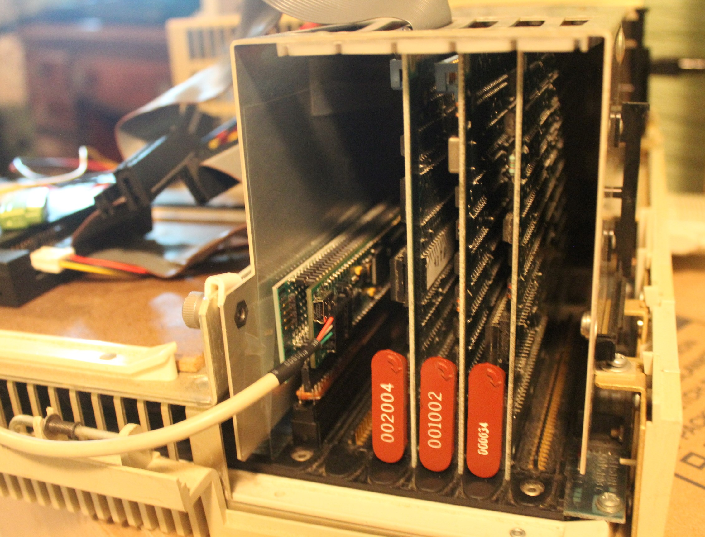
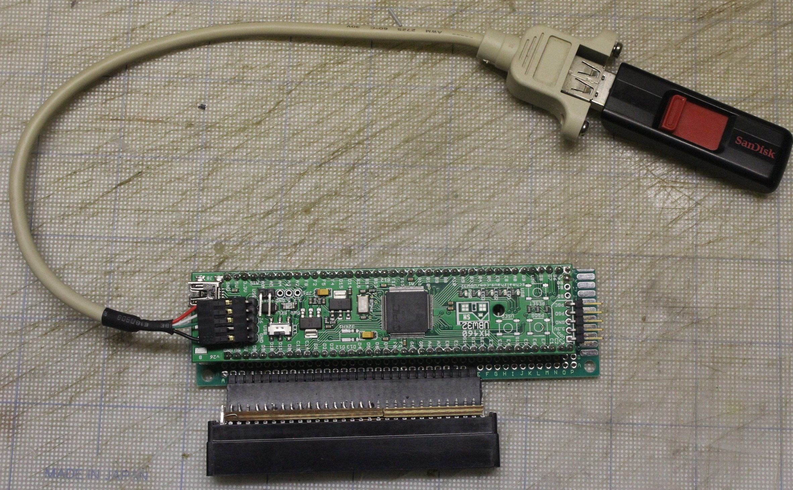
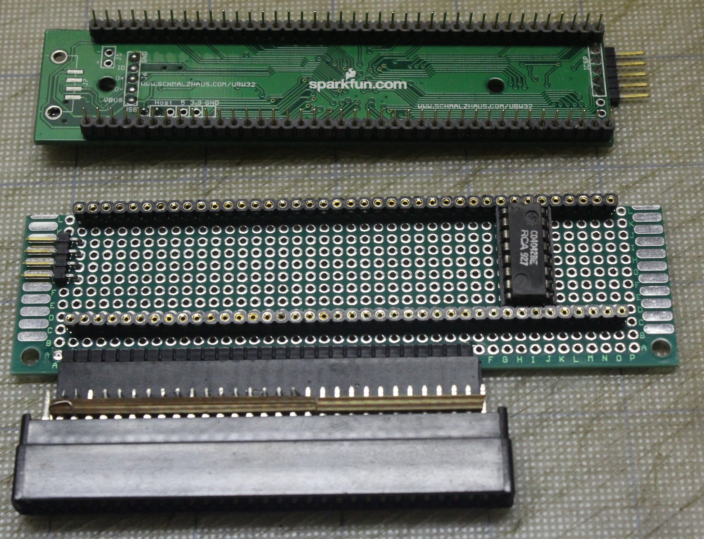
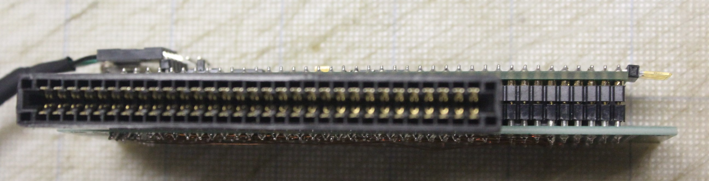
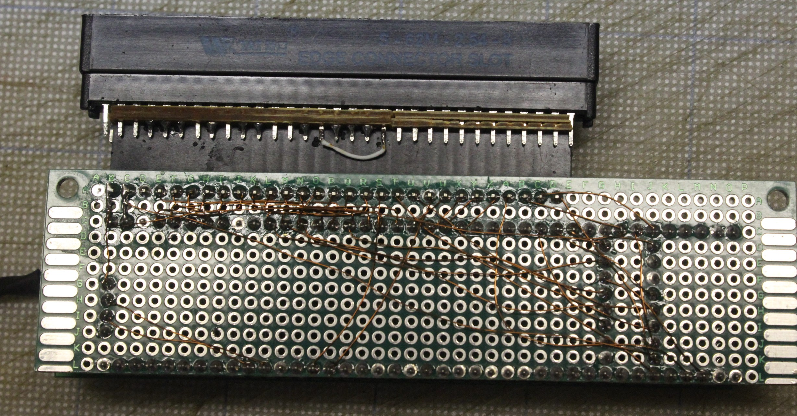

# Эмулятор контроллера/диска RD-5х для компьютера DEC Professional 3xx

Данный проект содержит программное обеспечение для микроконтроллера семейства PIC32 реализующее контроллер жесткого диска и сам жесткий диск модели RD5Х на внутренней шине старинного компьютера [Professional 3xx](https://en.wikipedia.org/wiki/DEC_Professional_(computer)) компании Digital Equipment Corporation, бывшего прототипом старинного советского компьютера [Электроника 85](https://ru.wikipedia.org/wiki/%D0%AD%D0%BB%D0%B5%D0%BA%D1%82%D1%80%D0%BE%D0%BD%D0%B8%D0%BA%D0%B0_85).

Программное обеспечение было проверено в работе на устройстве-прототипе подключающем плату микроконтроллера [UBW32](http://www.schmalzhaus.com/UBW32/) к шине CTI компьютера PРО-3XX. Описание прототипа также содержится в проекте.

Проект не является законченным: на настоящее время прототип успешно работает под управлением ОС RT-11, однако загрузку ОС P/OS пока произвести не удалось.

## Железо



Сигналы с шины CTI подключены напрямую к выводам микроконтроллера PIC32MX795F512L. Физически покупная плата с микроконтроллером [UBW32](http://www.schmalzhaus.com/UBW32/) смонтирована с помощью двух параллельных разъемов на макетной плате. 

Макетная плата припаяна к разъему обычно использовавшемуся на материнских платах IBM PC для шины ISA. Этот разъем имеет тот же шаг между контактами, что и оригинальный разъем на устройствах шины CTI. Пружинящие контакты в разъёме позволяют воткнуть разъем в шину CTI с приемлемой механической и электрической стабильностью. 

Соединения между контактами разъёмов на макетной плате выполнены пайкой трансформаторного провода. 


Список электрических цепей находится в файле [pinout.txt](./pinout.txt) в виде таблицы, где в колонке **CTI** находится номер контакта на разъеме шины, в колонке **BB-CTI** номер контакта разъема на макетной плате, **BB-UBW** номер контакта разъёмов для UBW32 на макетной плате, **Signal** - название сигнала CTI шины, **Port** - название вывода микроконтроллера. Идея в том, что сигналы в одной строке соединены проводниками. Номера контактов на макетной плате достаточно произвольны, главное, чтобы были правильные соединения между сигналами CTI шины и портами микроконтроллера. Таблица может служить основой для создания печатной платы устройства.

Обратите внимание на колонку **CD4042** - это единственная дополнительная микросхема размещенная на макетной плате. В колонке номера ножек, опять же в одном ряду с контактами/сигналами к ним соединенным.

## Код

Основная масса это стандартный код из библиотеки Harmony поставляемой компанией Microchip для своих микроконтроллеров. Собственно код обеспечивающий функции устройства находится в следующих файлах:
* firmware\src\app.h -- определения данных используемых устройством;
* firmware\src\app.c -- код инициализации, работы с файлом образа диска, обслуживанием команд контроллера диска;
* firmware\src\config\default\interrupts.c -- код обмена с шиной CTI в режиме прерывания;

### Сборка кода

Для сборки кода используется набор инструментов ["MPLAB X IDE"](https://www.microchip.com/en-us/tools-resources/develop/mplab-x-ide) и компилятор [XC32](https://www.microchip.com/en-us/tools-resources/develop/mplab-xc-compilers/downloads-documentation#XC32), бесплатно распространяемые компанией Microchip. Проект был собран версией инструментов 4.5 и компилятора 4.0

Я так понимаю, что установка библиотек [Harmony](https://www.microchip.com/en-us/tools-resources/configure/mplab-harmony) для сборки кода не требуется. Но если нужно изменить код под другую микросхему семейства PIC32, тогда нужно будет установить библиотеку и использовать утилиту конфигурации, поставляемую с ней.

### Программирование готового кода

Бинарный файл с текущей версией находится в файле `firmware\rd52a-ubw32.X\dist\default\production\rd52a-ubw32.X.production.hex `. Этот файл может быть записан в микроконтроллер с помощью утилиты "MPLAB X IPE" (входит в поставку "MPLAB X IDE") и совместимого программатора (я использовал Pickit 3).

## Использование устройства

Устройство делает доступным образ диска RD5X размещенный на носителе отформатированном под FAT и подключённом к USB разъему контроллера (обратите внимание, что это не разъем питания на плате UBW32, а не впаянный пятиштырьковый разъём). На носителе могут находиться несколько файлов с образами, и другие файлы. Используемый образ задаётся файлом `rdimage.cfg` в корне носителя. Этот файл должен состоять из __единственной__ строки содержащей путь к образу начинающийся с символа "/", например:
```
/rt-11.img
```
При присоединении носителя на плате UBW зажигается белый светодиод. Когда код определяет наличие файла образа имеющего поддерживаемый размер на плате зажигается жёлтый светодиод. При чтении с диска зажигается зелёный светодиод, при записи красный.

Код поддерживает те же размеры образов, что и эмулятор [xhomer](http://xhomer.isani.org/xhomer/), воспроизведённые ниже с сайта эмулятора:

|   Filesize|  Heads | Cylinders  |Sectors  |Disk type
|   --------|  ----- | ---------  |-------  |---------
|  5,013,504|      4 |       153  |     16  | RD50  5M
|  5,326,848|      4 |       153  |     17  | RD50  5M
| 10,027,008|      4 |       306  |     16  | RD51 10M
| 10,653,696|      4 |       306  |     17  | RD51 10M
| 20,152,320|      4 |       615  |     16  | RD31 21M
| 21,411,840|      4 |       615  |     17  | RD31 21M
| 33,554,432|      8 |       512  |     16  | RD52 36M
| 35,651,584|      8 |       512  |     17  | RD52 36M
| 40,304,640|      6 |       820  |     16  | RD32 43M
| 42,823,680|      6 |       820  |     17  | RD32 43M
| 67,108,864|      8 |      1024  |     16  | RD53 71M
| 71,303,168|      8 |      1024  |     17  | RD53 71M